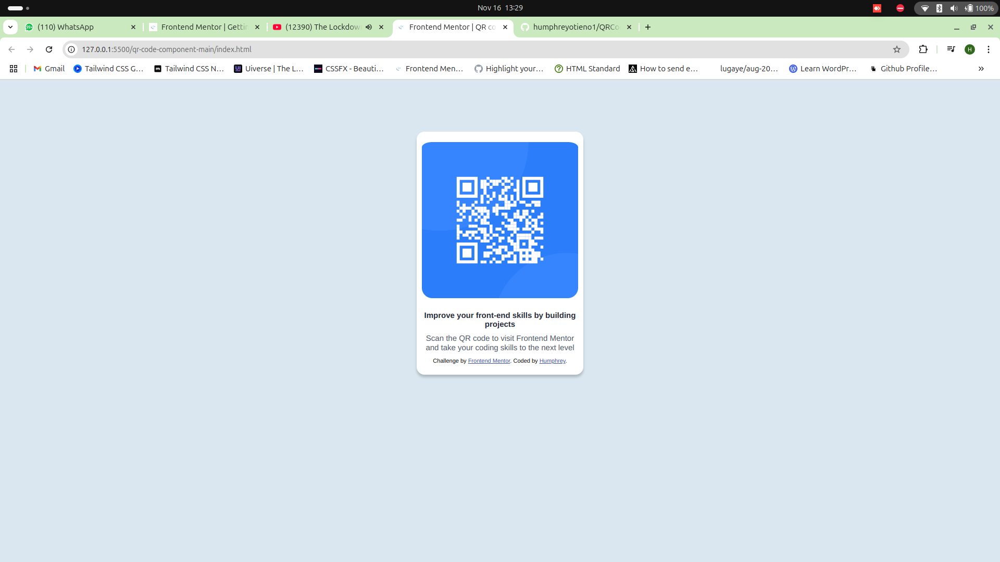

# Frontend Mentor - QR code component solution

This is a solution to the [QR code component challenge on Frontend Mentor](https://www.frontendmentor.io/challenges/qr-code-component-iux_sIO_H). Frontend Mentor challenges help you improve your coding skills by building realistic projects. 

## Table of contents

- [Overview](#overview)
  - [Screenshot](#screenshot)
  - [Links](#links)
- [My process](#my-process)
  - [Built with](#built-with)
  - [What I learned](#what-i-learned)
  - [Continued development](#continued-development)
  - [Useful resources](#useful-resources)
- [Author](#author)

**Note: Delete this note and update the table of contents based on what sections you keep.**

## Overview

### Screenshot

### Links

- Solution URL: [Add solution URL here](https://github.com/humphreyotieno1/QRCodeBasic.git)
- Live Site URL: [Add live site URL here](https://humphreyotieno1.github.io/QRCodeBasic/)

## My process

### Built with

- Semantic HTML5 markup
- CSS custom properties
- Flexbox
- CSS Grid
- Mobile-first workflow

### What I learned
During this project, I learned the basics of responsive web development and CSS basics. I gained a better understanding of how to create layouts that adapt to different screen sizes and how to use CSS properties effectively to style components.

### Continued development

In future projects, I want to continue focusing on responsive web design and the mobile-first approach. I aim to refine my skills in creating layouts that work seamlessly across various devices and screen sizes. Additionally, I plan to explore advanced CSS techniques and frameworks to enhance the responsiveness and performance of my web applications. By mastering these concepts, I hope to build more user-friendly and accessible websites.

### Useful resources
- [W3Schools HTML Tutorial](https://www.w3schools.com/html/) - This helped me understand the basics of HTML and how to structure a webpage effectively.
- [W3Schools CSS Tutorial](https://www.w3schools.com/css/) - This is an amazing resource that helped me grasp the fundamentals of CSS and how to style web components.
- [W3Schools Flexbox Guide](https://www.w3schools.com/css/css3_flexbox.asp) - This guide was instrumental in learning how to use Flexbox for creating responsive layouts.
- [W3Schools CSS Grid Guide](https://www.w3schools.com/css/css_grid.asp) - This article helped me understand CSS Grid and how to use it for complex layouts.

## Author

- Website - [Add your name here](https://humphrey-portfolio-rho.vercel.app/)
- Frontend Mentor - [@yourusername](https://www.frontendmentor.io/profile/humphreyotieno1)
- Twitter - [@yourusername](https://x.com/_Banta__)
